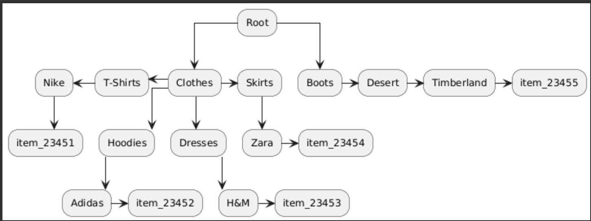

# Завдання №1

## Вхідні дані

Дані мають такий вигляд:

| **item_name** | **quantity** | **Tech categories** |
|:-------------:|:------------:|:------------------:|
| item_23451    | 150          | Nike,T-shirts,Clothes  |
| item_23452    | 75           | Adidas,Hoodies,Clothes |
| item_23453    | 200          | H&M,Dresses,Clothes   |
| item_23454    | 120          | Zara,Skirts,Clothes   |
| item_23455    | 20           | Timberland,Desert,Boots |

<div align="center">

</div>

---

## Використана структура даних

Для моделювання даних обрано **граф**, реалізований через **Adjacency List**.

- Це дозволяє ефективно стартувати пошук товарів з будь-якої категорії чи підкатегорії.
- Структура для збереження категорій:

```cpp
struct Category {
    std::string name;                       // назва категорії
    uint32_t total_quantity;                     // загальна кількість товарів у категорії (включно з підкатегоріями)
    std::unordered_set<std::string> subcategories; // підкатегорії
    std::unordered_set<std::string> items; // імена товарів у категорії (включно з підкатегоріями)
};
```

## Варіанти зберігання товарів
1) Зберігати об’єкти Item напряму (unordered_set< Item>)
Мінус: якщо, наприклад, є 100 різних товарів у категорії Clothes → T-shirts → Nike, кожен товар доведеться дублювати у трьох різних категоріях.
Це значно збільшує використання пам’яті.
2) Зберігати тільки імена товарів (unordered_set< string>)
Плюс: економія пам’яті, бо в категорії зберігаються лише унікальні назви.
Щоб отримати повний об’єкт Item, використовується глобальний unordered_map<string, Item>.
Складність отримання списку товарів (не імен) — O(N)